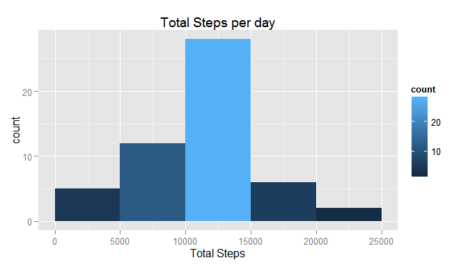
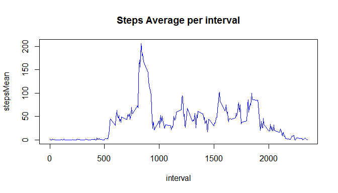
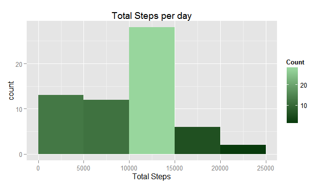

# Reproducible Research: Peer Assessment 1

<!-- Set the working directory first. Make sure it is in the same folder of the .Rmd script-->
## Loading and preprocessing the data

```r
#loading data
data<-read.csv("activity.csv")
#converting date column from factor to date type
data$date<-as.Date(data$date)
```


## What is mean total number of steps taken per day?

```r
#getting steps mean and median by date
steps_per_day_mean<-aggregate(data$steps, list(data$date), FUN = mean)
steps_per_day_median<-aggregate(data$steps, list(data$date), FUN = median)
steps_per_day_total<-aggregate(data$steps, list(data$date), FUN=sum)
#naming columns
names(steps_per_day_mean)<-c("date","stepsMean")
names(steps_per_day_median)<-c("date","stepsMedian")
names(steps_per_day_total)<-c("date","stepsTotal")
#merging dataframes
steps_per_day<-merge(steps_per_day_mean,steps_per_day_median)
steps_per_day<-merge(merge(steps_per_day_mean,steps_per_day_median),steps_per_day_total)
```
####**Histogram of total steps per day**

```r
library(ggplot2)
hist<-ggplot(steps_per_day,aes(x=steps_per_day$stepsTotal))
hist+geom_histogram(breaks=seq(0,25000,5000), aes(fill=..count..))+xlab("Total Steps")+ggtitle("Total Steps per day")
```

 

####**Mean and median total number of steps taken per day**

```r
steps_per_day[,c(1:3)]
```

```
##          date  stepsMean stepsMedian
## 1  2012-10-01         NA          NA
## 2  2012-10-02  0.4375000           0
## 3  2012-10-03 39.4166667           0
## 4  2012-10-04 42.0694444           0
## 5  2012-10-05 46.1597222           0
## 6  2012-10-06 53.5416667           0
## 7  2012-10-07 38.2465278           0
## 8  2012-10-08         NA          NA
## 9  2012-10-09 44.4826389           0
## 10 2012-10-10 34.3750000           0
## 11 2012-10-11 35.7777778           0
## 12 2012-10-12 60.3541667           0
## 13 2012-10-13 43.1458333           0
## 14 2012-10-14 52.4236111           0
## 15 2012-10-15 35.2048611           0
## 16 2012-10-16 52.3750000           0
## 17 2012-10-17 46.7083333           0
## 18 2012-10-18 34.9166667           0
## 19 2012-10-19 41.0729167           0
## 20 2012-10-20 36.0937500           0
## 21 2012-10-21 30.6284722           0
## 22 2012-10-22 46.7361111           0
## 23 2012-10-23 30.9652778           0
## 24 2012-10-24 29.0104167           0
## 25 2012-10-25  8.6527778           0
## 26 2012-10-26 23.5347222           0
## 27 2012-10-27 35.1354167           0
## 28 2012-10-28 39.7847222           0
## 29 2012-10-29 17.4236111           0
## 30 2012-10-30 34.0937500           0
## 31 2012-10-31 53.5208333           0
## 32 2012-11-01         NA          NA
## 33 2012-11-02 36.8055556           0
## 34 2012-11-03 36.7048611           0
## 35 2012-11-04         NA          NA
## 36 2012-11-05 36.2465278           0
## 37 2012-11-06 28.9375000           0
## 38 2012-11-07 44.7326389           0
## 39 2012-11-08 11.1770833           0
## 40 2012-11-09         NA          NA
## 41 2012-11-10         NA          NA
## 42 2012-11-11 43.7777778           0
## 43 2012-11-12 37.3784722           0
## 44 2012-11-13 25.4722222           0
## 45 2012-11-14         NA          NA
## 46 2012-11-15  0.1423611           0
## 47 2012-11-16 18.8923611           0
## 48 2012-11-17 49.7881944           0
## 49 2012-11-18 52.4652778           0
## 50 2012-11-19 30.6979167           0
## 51 2012-11-20 15.5277778           0
## 52 2012-11-21 44.3993056           0
## 53 2012-11-22 70.9270833           0
## 54 2012-11-23 73.5902778           0
## 55 2012-11-24 50.2708333           0
## 56 2012-11-25 41.0902778           0
## 57 2012-11-26 38.7569444           0
## 58 2012-11-27 47.3819444           0
## 59 2012-11-28 35.3576389           0
## 60 2012-11-29 24.4687500           0
## 61 2012-11-30         NA          NA
```

## What is the average daily activity pattern?
####**Time series plot of the 5-minute interval and the average number of steps taken, averaged across all days**

```r
steps_per_int_mean=aggregate(data$steps, list(data$interval), FUN=mean, na.rm=TRUE)
names(steps_per_int_mean)<-c("interval","stepsMean")
```

```r
plot(steps_per_int_mean, type="l",col="blue")
title("Steps Average per interval")
```

 


####**5-minute interval containing the maximum number of steps**


```r
steps_per_int_mean[which(steps_per_int_mean$stepsMean==max(steps_per_int_mean$stepsMean)),1]
```

```
## [1] 835
```
##**Imputing missing values**
####**Number of missing values in the dataset**

```r
nrow(data[ is.na(data$steps),])
```

```
## [1] 2304
```
####**Filling the missing values**
Missing values were filled using the median of the steps on all other days

```r
dataFilled<- data
steps_per_int_median=aggregate(data$steps, list(data$interval), FUN=median, na.rm=TRUE)
names(steps_per_int_median)<-c("interval","stepsMedian")

#Filling na values in steps field with steps median per interval

for (i in seq(1,nrow(dataFilled))){
        int <- dataFilled$interval[i]
        if  (is.na(dataFilled$steps[i])){
                dataFilled[1][i,] <- steps_per_int_median[steps_per_int_median$interval == int,]["stepsMedian"]
        }
}
```
They were then calculated the total, average and median steps using the new dataset

```r
steps_per_day_mean_DF<-aggregate(dataFilled$steps, list(dataFilled$date), FUN=mean)
steps_per_day_median_DF<-aggregate(dataFilled$steps, list(dataFilled$date), FUN=median)
steps_per_day_total_DF<-aggregate(dataFilled$steps, list(dataFilled$date), FUN=sum)
names(steps_per_day_mean_DF)<-c("date","stepsMean")
names(steps_per_day_median_DF)<-c("date","stepsMedian")
names(steps_per_day_total_DF)<-c("date","stepsTotal")
steps_per_day_DF<-merge(merge(steps_per_day_mean_DF,steps_per_day_median_DF),steps_per_day_total_DF)
```
The following histogram was made to present the results:

```r
library(ggplot2)
hist<-ggplot(steps_per_day_DF,aes(x=steps_per_day_DF$stepsTotal))
hist<-hist+geom_histogram(breaks=seq(0,25000,5000), aes(fill=..count..))+xlab("Total Steps")+ggtitle("Total Steps per day")
hist<-hist +scale_fill_gradient("Count", low = "#093B0D", high = "#98D69D")
hist
```

 

As you can see the values differ from the first histogram for the first five thousand steps. 


## Are there differences in activity patterns between weekdays and weekends?
####**Creating a new factor variable in the dataset with two levels - "weekday" and "weekend" indicating whether a given date is a weekday or weekend day.**

```r
library(plyr)
Sys.setlocale("LC_TIME", "C") # setting LOCAL TIME -> English
```

```
## [1] "C"
```

```r
dataFilled<-mutate(dataFilled, dayType = ifelse(weekdays(date) %in% c("Saturday","Sunday","sábado","domingo"),"weekend","weekday"))
```
####**Making a panel plot containing a time series plot (i.e. type = "l") of the 5-minute interval (x-axis) and the average number of steps taken, averaged across all weekday days or weekend days (y-axis)**

```r
DFSummary<-aggregate(dataFilled$steps, by=list(dataFilled$dayType,dataFilled$interval),FUN=mean)
names(DFSummary)<-c("DayType","Interval","Steps")
g<-ggplot(DFSummary,aes(Interval,Steps))
g+geom_line(color="#017292") +facet_wrap(~DayType, nrow=2, ncol=1)+labs(x="Interval")+labs(y="Number of steps")+labs(title="Steps by day type")
```

 

As you can see, there are some differences between the patterns of weekday and weekend day
